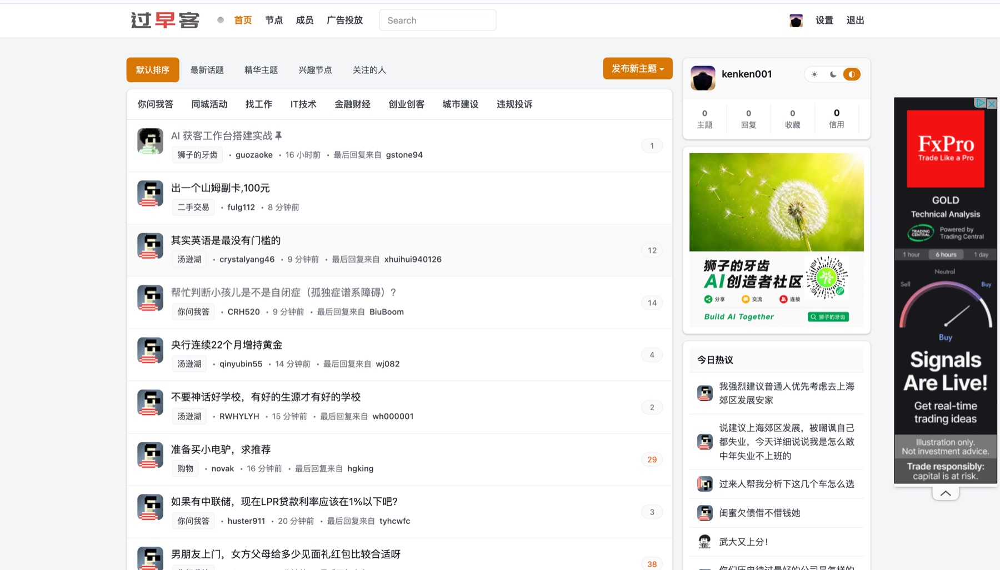
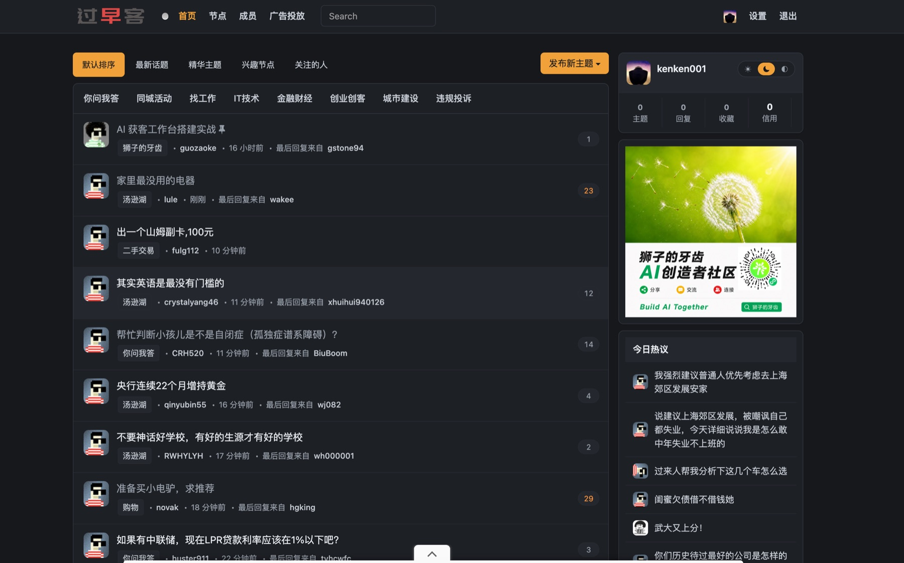
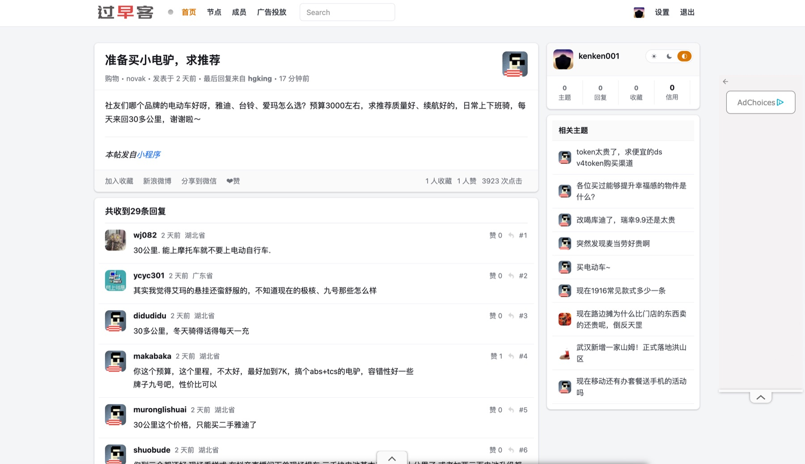
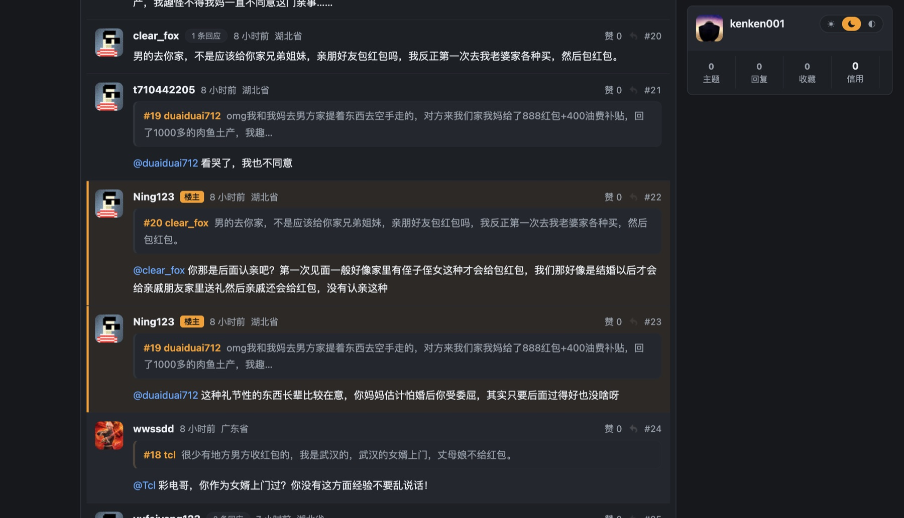
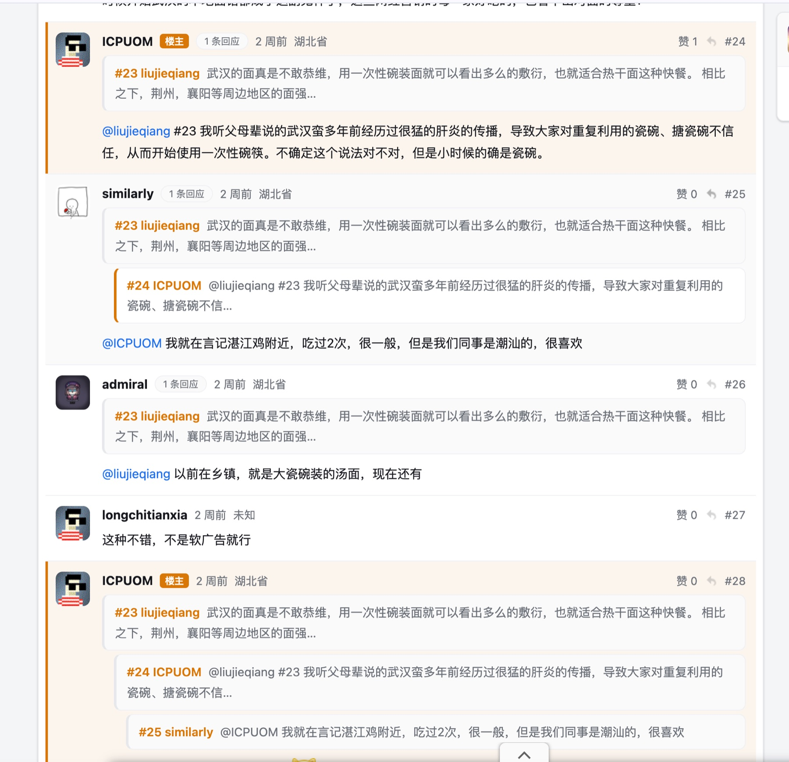

# 过早客 Polish

[](./LICENSE)

为 [过早客](https://www.guozaoke.com/) 打造的浏览器扩展，提供更现代的浏览体验：界面美化、深色模式、列表增强与话题页阅读增强。参考 [V2EX_Polish](https://github.com/coolpace/V2EX_Polish) 的产品思路重新实现，支持 Chrome / Edge / Firefox。

只做浏览侧的改善，不改动站点数据、不模拟任何用户操作。

## 截图

| 浅色 | 深色 |
| --- | --- |
|  |  |
|  |  |

多层盖楼的引用堆：



楼主高亮与长回复折叠：


## 功能

### 界面美化与深色模式

- 重排版式、容器卡片化、弱化次要信息，字号与间距整体收紧
- 浅色 / 深色 / 跟随系统三态主题，切换入口在右侧个人信息卡上
- 个人信息卡随页面滚动吸顶

### 列表增强

- 已读主题淡化
- 按关键词 / 节点 / 用户屏蔽主题，折叠为一行可展开的占位
- 回复数按热度着色
- 当前排序 / 节点页签高亮

### 话题页阅读增强

- 解析 `@用户名` 的引用关系，在回复上方插入可点击的引用块，支持多层盖楼
- 被引用的回复显示「N 条回应」徽章
- 楼主的回复高亮标记
- 热门回复区：按赞数与被引用次数筛选并置顶展示
- 长回复折叠，一键展开
- 注入楼层锚点，修复站点原有 `#replyN` 链接跳不动的问题
- 自动合并分页回复，使引用关系与热门回复覆盖全部楼层

## 安装

### 从源码构建

```bash
pnpm install
pnpm build          # 产物在 build-chrome/ 与 build-firefox/
```

只想加载未打包版本的话，`pnpm build:all` 之后直接用 `extension/` 目录。

### 加载到浏览器

**Chrome / Edge**：打开 `chrome://extensions`（Edge 为 `edge://extensions`），开启开发者模式，点「加载已解压的扩展程序」，选择 `extension/` 目录或解压后的 zip。

**Firefox**：打开 `about:debugging#/runtime/this-firefox`，点「临时载入附加组件」，选择解压目录里的 `manifest.json`（临时载入在浏览器重启后失效）。

## 开发

```bash
pnpm dev          # 构建 + 监听 + 拉起带扩展的 Chrome
pnpm test         # 单元测试
pnpm typecheck    # 类型检查
pnpm preview <名称> [auto|light|dark]   # 用本地样本渲染一张离线预览页
```

### 关于测试样本

`samples/` 下原本是真实页面快照，因为含网友的用户名与发言原文，**不随仓库分发**。缺少这些文件时，`vitest.config.ts` 会自动排除依赖它们的用例，其余纯逻辑用例照常运行。想跑全量测试，自行保存几份页面到 `samples/` 即可，文件名参照 `vitest.config.ts` 里的列表。

## 隐私

- 只在 `guozaoke.com` 域下运行，权限只申请 `storage`
- 配置与已读记录存在浏览器本地（`chrome.storage`），不上传任何数据，包内无统计与上报代码
- 唯一的网络请求是话题分页合并时拉取同站的其余分页，可在设置中关闭
- 不读取、不存储、不发送 Cookie 或登录态

## 许可

MIT
